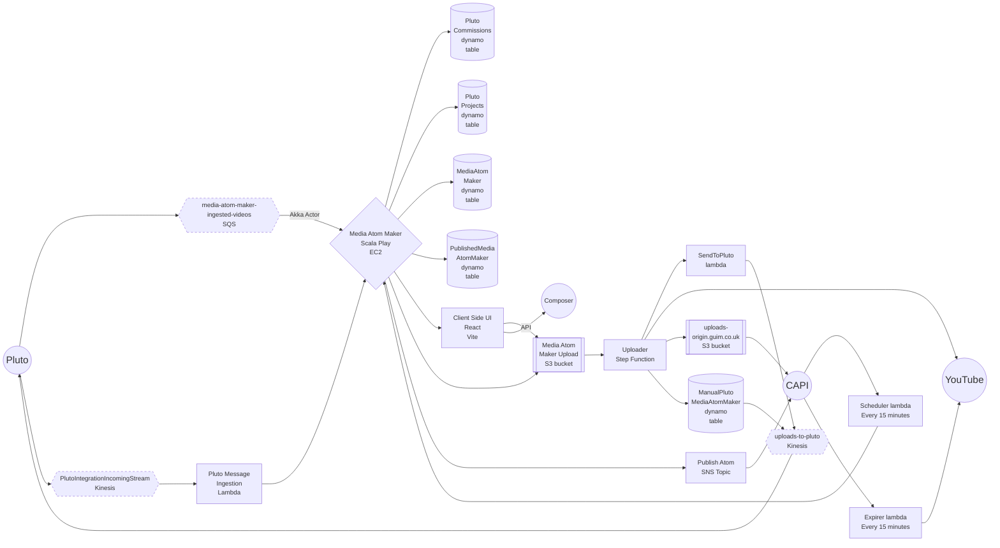

# Architecture

## Graph

## Design

## Integrations

### Pluto

[Pluto Message Ingestion](../pluto-message-ingestion/README.md)

### CAPI

### YouTube

[Uploader](../uploader/README.md)

[Further reading](08-youtube.md)

### Composer

[Further reading](09-composer-integration.md)
