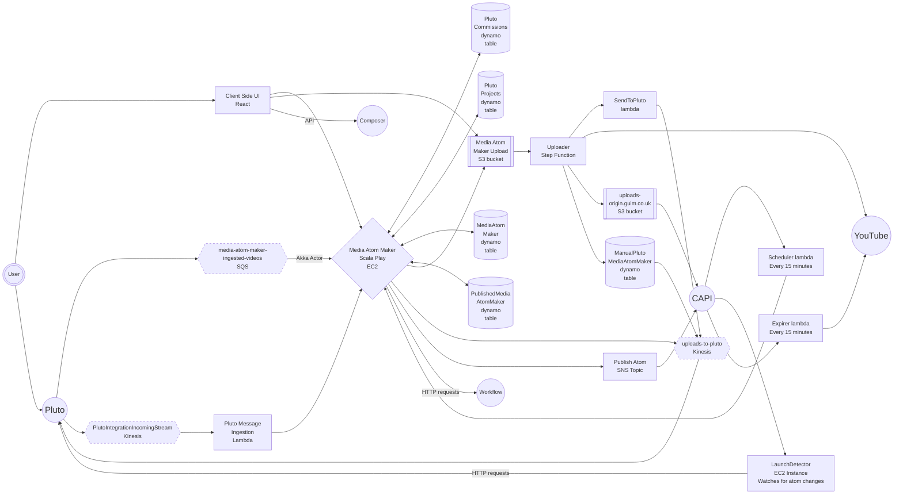
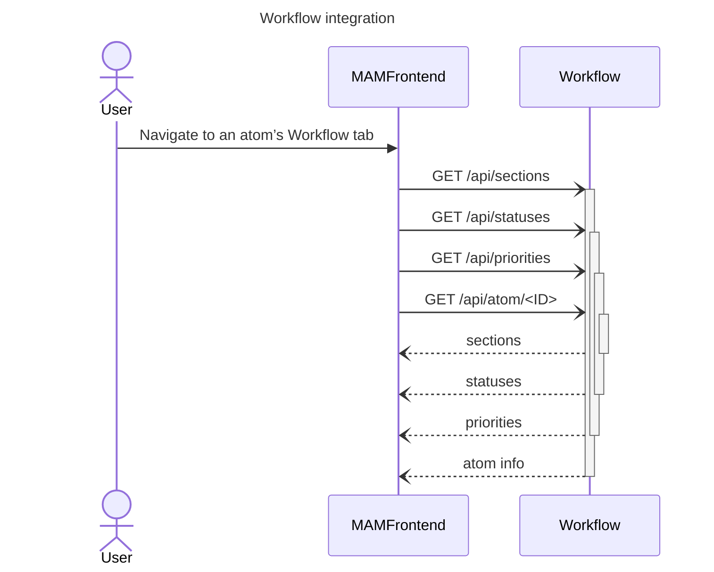

# Architecture

## Graph

## Design

Media Atom Maker (MAM) is architected as a collection of resources, primarily a Scala Play App with a React frontend
that facilitates the management and publishing of video content, typically hosted in YouTube. This system is built using
various AWS services, including S3 buckets, Lambdas, Step Functions, and DynamoDB for content state management. It
integrates with Composer, YouTube, the Content API (CAPI), and Pluto for content its publishing workflows.

### EC2 Backend

The main backend of MAM is a Scala Play App running on EC2 serving the client side and providing an API to manage media
atoms and other metadata. It manages the content state using DynamoDB tables.

### Client Side

The client side is a React app bundled using Vite and served via the Play app. The project uses Redux for state
management.

### Uploader

The backend grants browser credentials for direct upload of media content to an S3 bucket. Objects are then picked up by
the Uploader step function and processed. These assets are either sent to YouTube or processed and added to the
`uploads.guim.co.uk` S3 bucket.

[Uploader Step Function README](../uploader/README.md)

### Cloudformation Stacks

The application has several cloudformation stacks:

- media-atom-maker-{Stage} – Primary resources stack
- media-atom-maker-{Stage}-dynamo – DynamoDB tables (AtomMaker, PublishedAtomMaker and ManualPlutoAtomMaker)
- media-atom-pipeline-{Stage} – Uploader step function resources
- media-atom-maker-DEV – Resource for integration with local testing (different template to the primary stack)

## Integrations

### Pluto

Pluto is the Guardian's media asset management system, confusingly also referred to as MAM. Its taxonomy consists of
Commissions, Projects and Deliverables. It provides a way to manage media assets, and expects users to have access to
the shared asset drive.

Media Atom Maker and Pluto communicate via Kinesis and SQS to transmit updates and metadata between each system.

Commissions and Projects are ingested via the Pluto Message Ingestion Kinesis stream and stored in DynamoDB. These can
then be applied to media atoms to provide navigation between content and their assets.

Media Atom Maker events are sent to Pluto via the Upload To Pluto Kinesis stream. These include notifications of when
videos are uploaded, and when Pluto projects are assigned to atoms.

There is also an EC2 [LaunchDetector service](https://github.com/guardian/multimedia-launchdetector-v3) which watches CAPI's firehose stream for atom changes and makes HTTP
requests to Pluto services.

[Pluto Message Ingestion](../pluto-message-ingestion/README.md)

### CAPI

Media atoms are published via CAPI using the Publish Atom SNS topic.

The Expirer lambda periodically checks the state of media atoms in CAPI and if they are expired updates their status in
YouTube to private.

The Scheduler lambda periodically checks the state of media atoms in preview CAPI and if they are scheduled for launch sends a
request to the media atom maker backend API to publish them.

### YouTube

YouTube is the main host for Guardian media content. Media Atom Maker communicates with YouTube via its APIs.

[Documentation](08-youtube.md)

### Composer

Composer is the Guardian's digital CMS. Media Atom Maker makes calls to the Composer API in order to create content
pages for media atoms.

It also allows videos to be embedded into Composer content using an iFrame interface of the MAM UI to choose the right
atom.

[Documentation](09-composer-integration.md)

### Workflow

[Workflow](https://github.com/guardian/workflow/) is a Guardian tool, used for tracking content in production. Media Atom Maker can display the Workflow state for any atom tracked in Workflow, and offers users the ability to edit it.

On loading the Workflow tab in the UI, the atom is looked up in workflow.

