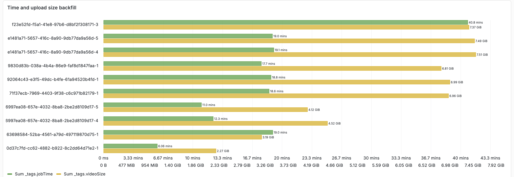
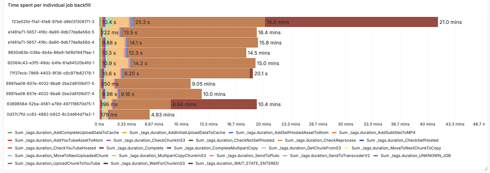
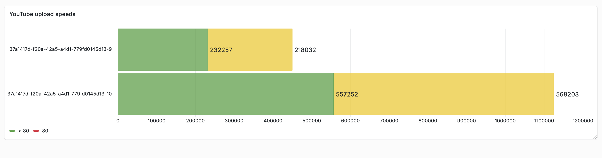

# Pipeline Speed Investigation

## Context

Media Atom Maker supports video uploads. In the majority of cases the videos that get uploaded are pretty small
and don't take much time to upload. However, we also have examples of videos taking a long time to upload when
videos are a larger size. This can be a frustrating user experience, especially since a user needs to keep the
tab open until the video upload has happened. The use case for large video uploads are expected to increase
as there are plans to publish more long form video podcasts.

## Metrics

The following charts show a sample of videos that were uploaded to PROD that took longer than 5 minutes to load

**This chart shows the video size by the time taken for the pipeline to complete**



**This chart shows the video upload time broken by individual steps.**


The consistently largest bar is the step called `UploadChunkToYouTube` which is the step
that is uploading to YouTube.

The other occasionally large bar is the `WaitForChunkInS3`, which represents the job needing to
wait for the next part of the file to be available in s3 before making the next request to upload to YouTube.
When this is large this would indicate a slow network upload speed.


[Grafana Dashboard](https://metrics.gutools.co.uk/d/li682cm/mam-snapshot-of-large-prod-uploads?orgId=1&from=2026-05-07T17:45:00.000Z&to=2026-05-07T18:00:00.000Z&timezone=browser)

## YouTube API

The YouTube API has [Resumable Uploads](https://developers.google.com/youtube/v3/guides/using_resumable_upload_protocol?_gl=1*b13837*_up*MQ..*_ga*MTA1MzU0MzcyOS4xNzgxMTg4MTQy*_ga_SM8HXJ53K2*czE3ODExODgxNDIkbzEkZzAkdDE3ODExODgxNDIkajYwJGwwJGgw)
which enable to user to be able to send a file and be able to resume the upload from the last good point.

The current architecture of Media atom maker uses [Upload In Chunks](https://developers.google.com/youtube/v3/guides/using_resumable_upload_protocol?_gl=1*b13837*_up*MQ..*_ga*MTA1MzU0MzcyOS4xNzgxMTg4MTQy*_ga_SM8HXJ53K2*czE3ODExODgxNDIkbzEkZzAkdDE3ODExODgxNDIkajYwJGwwJGgw#Uploading_Chunks)

The benefit of using a chunking approach is that the upload to s3 step can be parallelized with uploading to YouTube.

However, the advice from the docs states:
```This approach is rarely necessary and is actually discouraged because it requires additional requests, which have performance implications. However, it might be useful if you are trying to display a progress indicator on a very unstable network.```

In order to validate whether the approach we are using to upload to YouTube is significantly more time consuming
than the recommended way of using the API without chunks an experiment was run in the CODE environment.

This was done by adding an extra step to the step function which uploads to YouTube without chunking.


**This chart shows the time spent uploading the video by API call**



The green bar represents uploading to YouTube using chunking (the current approach) and the yellow bar represents uploading to YouTube without chunking

Whilst there may be a few more gains from sending fewer network requests, the overall time taken is not significant enough to
motivate a change to use this approach.


## Conclusion

We investigated slow upload times by measuring the different stages of the upload process and testing an alternative API-based upload approach.

The alternative approach did not produce a measurable improvement in upload performance, indicating that the upload mechanism itself is not the primary cause of the delays.


